# Artifacts

## Orientation

An Artifact is the product bet that a thinking session should be able to leave behind a work product — a blog-post draft, a plan, a set of notes synthesized from a conversation the user just had. The vision scopes this deliberately small: synthesis is rare, offered rather than prompted, and `vision/vision.md` lists an artifact storage library among the things explicitly outside the MVP, with synthesis output going to the clipboard. HEAD carries far more machinery than that bet: a Neo4j `Artifact` node type with its own repository and two competing provenance edge conventions, plus an unrelated read-only Supabase `artifact` table behind a REST surface. Nothing in the repository connects the two, no client displays either, and the one write path that exists cannot commit.

## The path

```mermaid
flowchart TD
    subgraph write["Write path — Neo4j, currently fails at the driver"]
        A["Conversation agent tool set<br/>backend/src/agents/orchestrator.ts"] --> B["create_artifact / update_artifact<br/>backend/src/agents/tools/nodes/artifact.tool.ts"]
        B --> C["ArtifactRepository.create / update<br/>backend/src/repositories/ArtifactRepository.ts"]
        C -->|"content bound as a map property"| D["Neo4j rejects the property<br/>backend/src/db/neo4j.ts"]
        D -->|"error caught in the tool"| E["Tool returns {success:false} to the model"]
    end
    subgraph read["Read path — Supabase, no writer anywhere"]
        F["Supabase artifact table<br/>backend/supabase/migrations/"] --> G["ArtifactService list/get<br/>backend/src/services/artifactService.ts"]
        G --> H["GET /api/artifacts, GET /api/artifacts/:id<br/>backend/src/routes/artifacts.ts"]
        H --> I["No client consumes this surface"]
    end
```

## Ownership map

| Stage | Owning directory | Entry-point files |
|---|---|---|
| Tool registration on the conversation agent | `backend/src/agents/` | `backend/src/agents/orchestrator.ts` |
| Tool input schemas and ownership check | `backend/src/agents/tools/nodes/`, `backend/src/agents/schemas/` | `backend/src/agents/tools/nodes/artifact.tool.ts`, `backend/src/agents/schemas/ingestion.ts` |
| Neo4j Artifact reads, writes, and edges | `backend/src/repositories/` | `backend/src/repositories/ArtifactRepository.ts`, `backend/src/repositories/SourceRepository.ts` |
| Neo4j constraint and indexes | `backend/src/db/` | `backend/src/db/schema.ts` |
| Supabase read model and REST surface | `backend/src/services/`, `backend/src/controllers/`, `backend/src/routes/` | `backend/src/services/artifactService.ts`, `backend/src/controllers/artifactController.ts`, `backend/src/routes/artifacts.ts` |
| Supabase table and DTO shape | `backend/supabase/migrations/`, `backend/src/types/` | `backend/src/types/dto.ts` |
| Retention treatment | `backend/src/services/` | `backend/src/services/decayService.ts` |
| Graph exposure | `backend/src/services/`, `backend/src/repositories/`, `web/src/` | `backend/src/services/graphService.ts`, `backend/src/agents/tools/retrieval/explore.tool.ts`, `web/src/app/viewer/page.tsx` |

## Invariants and why

### Two stores that share only a name

- The Neo4j `Artifact` node and the Supabase `artifact` row are separate models with no reconciliation: the row carries `neo4j_node_id` as the intended bridge, and no code in the repository ever sets it.
- No code writes the Supabase `artifact` table. `ArtifactService` exposes list and get only, the router mounts only two authenticated GETs, and there is no create controller, service method, or migration trigger; the REST surface is a read model for rows nothing produces.
- The two shapes are not translatable as they stand: the row is `{conversation_id, type, title, content}` with `content` as plain text, while the node is `{entity_key, name, description, content:{type,output}, sensitivity, ttl_policy}` with no conversation reference. Choosing a system of record is a product decision that has not been made, which is why neither half was finished.

### The Neo4j write path fails at the driver

- `ArtifactRepository.create` binds `content` — an object — straight into a Cypher property. `neo4jService.executeQuery` drops `undefined` values and serializes results, but never serializes parameters, so Neo4j rejects the map and the statement throws; `SourceRepository` avoids this by JSON-stringifying its equivalent field.
- The create tool wraps the repository call in try/catch and returns `{success:false, error}` as its tool result, so the model receives a failure string in the transcript rather than the turn erroring — the failure is visible only in the tool result and the span event.
- `update_artifact` composes its input schema from the create schema's fields, which keep `description` and `content` required, so a genuine partial update such as `{entity_key, name}` is rejected by validation before the repository is reached.
- Ownership on update is enforced in the tool (fetch by `entity_key`, compare `user_id`) and not in the repository — `ArtifactRepository.update` matches on `entity_key` alone, so any future caller that skips the tool skips the check.
- The `Artifact` interface in `backend/src/types/graph.ts` requires `id`, which the CREATE never sets; this is the same driver-boundary looseness that affects every node type, not an artifact-specific gap.

### Provenance is defined twice, in opposite directions, and used never

- `ArtifactRepository` implements `(Artifact)-[:sourced_from]->(Source)` and reads `(Concept)-[:produced]->(Artifact)`; `SourceRepository` implements `(Source)-[:produced]->(Artifact)` both singly and in bulk. Both conventions are live code and no caller exists for either, so use has never settled the canonical direction.
- Both edge writers check for an existing edge and throw when one is found, so these are create-once operations, not idempotent links — a replay is an error rather than a no-op.
- `ArtifactRepository.relateToNode` interpolates the target label into Cypher from the closed `EntityType` union rather than binding it, which is safe only because the union is code-controlled.
- Ingestion never creates an Artifact: the pipeline ends at semantic nodes, semantic relationships, and Source mentions, so an information dump or transcript cannot become an Artifact today.

### Identity, scope, and retention

- `entity_key` is `sha256(lowercased description + user_id + created_at)`, so identity includes the creation instant: the same description written twice yields two distinct nodes and there is no MERGE path for Artifacts at all.
- `backend/src/db/schema.ts` declares the `entity_key` uniqueness constraint plus `user_id` and `created_at` indexes for Artifact, and every repository read filters on the node's `user_id`; scope is per-user even when the originating Source is shared.
- `sensitivity` defaults to `normal` and has no consumer anywhere in the backend — it is a declared governance field with no enforcement point.
- `ttl_policy` defaults to `decay`, and `decayService` includes Artifact among its decayed labels with a 30-day ephemeral window (Source shares that window; every other label gets 90 days). The decay query only selects nodes with `salience > 0`, and the create path sets neither `salience` nor `state`, so an Artifact created by the tool is never reached by decay.

### Reachability from retrieval and clients

- Explore accepts `artifact` in `node_types` and has a result branch for it, but filters `artifact` out of both the vector search and the text search that produce candidates, so the branch cannot fire; artifacts also receive no embedding at creation, which excludes them from the UMAP projection, whose query requires an embedding.
- The full-graph query behind the web visualizer matches any node carrying the user's `user_id` regardless of label, so an Artifact would render there; the viewer already ships an `artifact` type filter and colour, and the landing page's demo graph contains a fabricated artifact node.
- No client lists artifacts. The former iOS client is archived at git tag `archive/ios-2026-09-03` and had no artifact screen; web has no artifact page, and the two GET endpoints have no caller in this repository.
- The create and update tools are registered only on the conversation agent assembled in `backend/src/agents/orchestrator.ts` and reached through `conversationService`; that assembly is slated for removal by the agent-layer rework, which would leave the Neo4j Artifact write path with no caller at all.

## Edges

- [[saturn/patterns/provenance-and-personal-scope]] — evidence and ownership
- [[saturn/patterns/neo4j-repositories]] — graph write rules
- [[saturn/patterns/agent-execution]] — tool registration
- [[saturn/patterns/postgres-schema-and-types]] — the Supabase read model
- [[saturn/arch/retrieval]] — graph consumption
