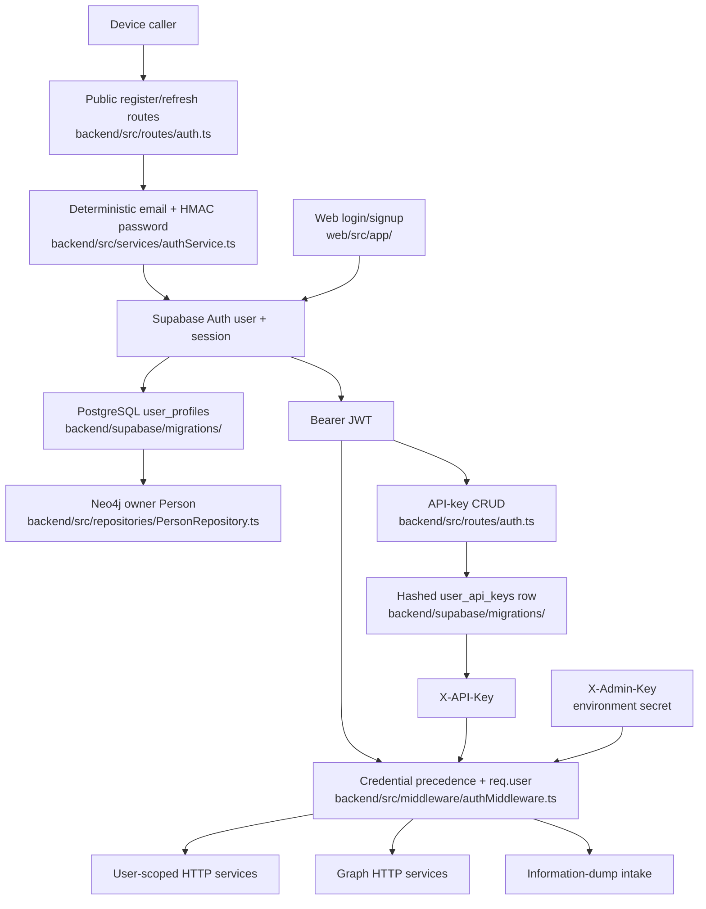

# Auth and identity

## Orientation

Saturn uses a Supabase Auth user UUID as the canonical subject across PostgreSQL profiles, API keys, Sources, and Neo4j personal scope. Device credentials, web email/password sessions, per-user API keys, and one environment-wide admin key all enter the backend through different paths; authentication converges on `req.user`, but each service remains responsible for enforcing what that subject may access. Production is down, both cloud Supabase projects are paused, and these paths currently run against the local stack.

The former iOS client that kept the device UUID and refresh tokens in Keychain is archived at git tag `archive/ios-2026-09-03`; no client in this checkout currently drives device registration or refresh.

## The path

## Ownership map

| Stage | Owning directory | Entry-point files |
|---|---|---|
| Supabase Auth and service-role access | `backend/src/db/` | `backend/src/db/supabase.ts` |
| Device credentials, token validation, profiles, and API keys | `backend/src/services/` | `backend/src/services/authService.ts` |
| Credential precedence and `req.user` projection | `backend/src/middleware/` | `backend/src/middleware/authMiddleware.ts` |
| Device, refresh, profile, and API-key HTTP contract | `backend/src/routes/` | `backend/src/routes/auth.ts` |
| PostgreSQL identity records | `backend/supabase/migrations/` | `backend/supabase/migrations/20240101000000_init.sql`, `backend/supabase/migrations/20260307000000_auth_and_identity.sql` |
| Neo4j owner Person | `backend/src/repositories/` | `backend/src/repositories/PersonRepository.ts` |
| Web email/password and cookie session | `web/src/app/`, `web/src/lib/supabase/` | `web/src/app/login/page.tsx`, `web/src/app/signup/page.tsx`, `web/src/lib/supabase/client.ts`, `web/src/lib/supabase/server.ts` |
| Web route gating | `web/src/` | `web/src/middleware.ts`, `web/src/lib/supabase/middleware.ts` |
| Cross-user information-dump proxy | `web/src/app/api/upload/`, `backend/src/controllers/` | `web/src/app/api/upload/route.ts`, `backend/src/controllers/informationDumpController.ts` |
| User-targeted graph authorization | `backend/src/routes/`, `backend/src/controllers/`, `backend/src/services/` | `backend/src/routes/graph.ts`, `backend/src/controllers/graphController.ts`, `backend/src/services/graphService.ts` |
| Environment-bound retrieval transport | `backend/src/` | `backend/src/mcp.ts` |

## Invariants and why

### Canonical subject and stores

- The Supabase Auth user UUID is the shared subject: it is `user_profiles.id`, `user_api_keys.user_id`, each PostgreSQL Source `user_id`, and the `user_id` tenancy property on Neo4j nodes. The shared value enables joins across stores but supplies no cross-store transaction or authorization check by itself.
- Every backend Supabase operation uses one service-role singleton with session persistence and automatic refresh disabled; bearer-token validation explicitly calls `auth.getUser`, while all profile and domain authorization is application logic because the checked-in migrations declare no RLS policies.
- `user_profiles.id` has no checked-in foreign key to `auth.users`, and `user_profiles.device_id` has no uniqueness constraint. Device-to-user uniqueness is therefore procedural, while all web-created profiles deliberately share the literal device ID `web`.
- PostgreSQL `user_profiles` is the application profile authority; the Neo4j owner Person is a separate graph identity used to anchor personal memory and provenance. Neither store repairs the other after a partial write.

### Device credentials and sessions

- Device registration accepts any non-empty string and derives both credentials from it: the pseudo-email removes every non-alphanumeric character and uses `DEVICE_AUTH_DOMAIN`, while the password is an HMAC-SHA256 value under `DEVICE_AUTH_SECRET`. Possession of the device ID alone is insufficient without the server secret.
- Registration first looks up `user_profiles.device_id`, then tries the deterministic Supabase credentials, and only then creates a Supabase Auth user. This lets a missing profile be recreated from an existing Auth account, but it also makes the deterministic credentials the durable recovery path rather than the PostgreSQL row alone.
- `ensureSupabaseUserCredentials` updates the password only when email, device metadata, or confirmation state differs; rotating `DEVICE_AUTH_SECRET` alone does not trigger that update, so existing deterministic sign-in credentials stop matching.
- `/api/auth/register`, `/api/auth/refresh`, and `/api/auth/validate` are public credential-establishment routes. Refresh accepts a body refresh token; validate and protected routes validate bearer access tokens against Supabase rather than trusting JWT claims locally.
- Refresh-token rotation is owned by Supabase Auth and returned to the caller with the replacement access token. The backend stores neither token and has no server-side device session record beyond the Auth account and profile.

### Profile and owner Person creation

- A brand-new device registration writes the Supabase Auth user, then the PostgreSQL profile, then the Neo4j owner Person before signing in; no transaction spans those steps, so an earlier identity can remain after a later step throws.
- Returning-device paths ensure Supabase credentials and the PostgreSQL profile but do not ensure an owner Person. Web `/api/auth/me` also auto-creates only a PostgreSQL profile, so successful authentication does not imply that the graph owner exists.
- A web profile uses `device_id='web'`; PATCHing a non-empty `display_name` is the web path that attempts `findOrCreateOwner`. A Neo4j failure is logged and swallowed after the PostgreSQL profile update, and there is no queued repair or reconciliation pass.
- `findOrCreateOwner` is application-enforced check/clear/create logic because Neo4j has no partial uniqueness constraint for one `is_owner=true` Person per user. Its owner name is either the display name or a `Device ` prefix plus the first eight device-ID characters.
- Onboarding completion is a bearer-protected update of `user_profiles.onboarding_completed`; it does not create or verify the owner Person.

### Credential classes and authority

- `authenticateToken` checks a valid `X-Admin-Key` first, then `X-API-Key`, then a bearer token. All successful branches produce a Supabase-shaped `req.user`, but the admin branch uses the synthetic subject ID `admin` and email `admin@localhost` rather than a persisted user.
- The admin key is one environment-wide bearer secret with no role record, expiry, revocation row, or actor identity. Queue-admin routes validate the same `ADMIN_API_KEY` separately instead of using `authenticateToken`.
- API keys are `sk_` plus random bytes; PostgreSQL stores only SHA-256 hash, eight-character prefix, owner, label, use time, and revocation time. Creation returns the raw key once, validation narrows by prefix and active status before comparing hashes, and a failed `last_used_at` update does not reject the request.
- API-key list and revoke operations filter by `req.user.id`, while key validation loads the owning Supabase user through the service-role admin API. An API key therefore acts with the same user subject as a bearer JWT, not as a narrower capability.
- The web browser and server Supabase clients use the anon key and cookie session, while backend domain access uses the service role. Web middleware protects only `/dashboard`; backend authorization remains mandatory for every API request.

### Authorization boundaries at HEAD

- Authentication and ownership are separate checks. Conversation, preference, artifact, and information-dump paths pass `req.user.id` into their data services, but graph routes accept path or body user IDs without comparing them with `req.user.id`.
- Every graph route requires one accepted credential, yet `GET /api/graph/users` enumerates all owner nodes and user-targeted routes can read another user's graph. `POST /api/graph/query` executes caller-supplied Cypher after only checking that the query text contains a `user_id` spelling; the check neither proves read-only behavior nor proves scope.
- The web upload proxy requires some Supabase session, then replaces that identity with `X-Admin-Key` and forwards a caller-selected `user_id`; the backend explicitly permits that cross-user target for the synthetic admin subject. The web proxy reads `ADMIN_KEY`, while backend middleware reads `ADMIN_API_KEY`, so deployment configuration must provide the same secret under two names.
- The memory-chat route `/api/chat/stream-memory` is unauthenticated and accepts a body `userId` at HEAD; it is slated for removal by the agent-layer rework, and the retrieval surface becomes the Saturn crtr plugin.
- The `/mcp` transport is unauthenticated and binds every client to the process-wide `SATURN_USER_ID` at HEAD; it is slated for removal by the agent-layer rework, and the retrieval surface becomes the Saturn crtr plugin.
- `optionalAuth` accepts the same three credential classes and suppresses all validation errors, but no route currently installs it; public routes are explicit rather than optionally personalized.

## Edges

- [[saturn/arch/information-dumps]] — admin-scoped intake
- [[saturn/patterns/api-contracts]] — auth envelopes
- [[saturn/patterns/postgres-schema-and-types]] — identity records
- [[saturn/arch/conversation-lifecycle]] — authenticated ownership
- [[saturn/patterns/provenance-and-personal-scope]] — tenancy boundary
- [[saturn/arch/retrieval]] — graph authorization
