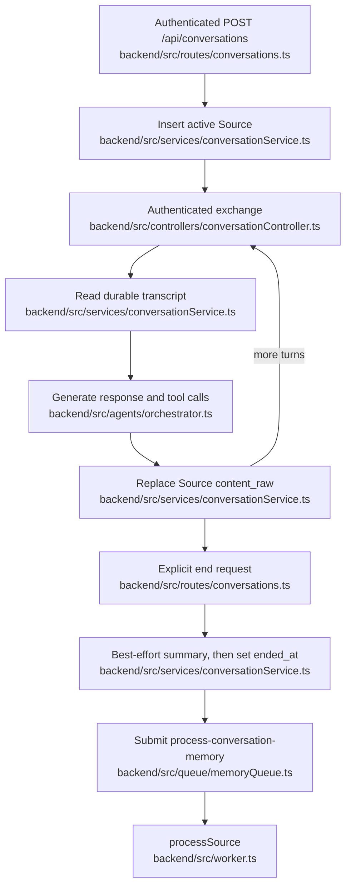

# Conversation lifecycle

## Orientation

A conversation is a PostgreSQL Source whose JSON transcript grows through authenticated request/response turns and becomes eligible for asynchronous memory ingestion only after an explicit end request. The lifecycle preserves raw conversational evidence before the graph derives memory from it, but it has no live client: the former iOS client is archived at git tag `archive/ios-2026-09-03`, and no client currently drives this backend contract.

## Boundary and state space

PostgreSQL is authoritative for conversation and onboarding state; model execution and queue submission cross separate commit boundaries.

| Axis | Values | Durability | Authoritative writer | Meaning |
|---|---|---|---|---|
| Source `ended_at` | `null`, timestamp | durable | `backend/src/services/conversationService.ts` | The sole conversation-status fact: `null` projects to active and a timestamp projects to completed. |
| Source `content_raw` | JSON array of stored messages | durable | `backend/src/services/conversationService.ts` | The complete model transcript, including system and tool messages; API history is only a projection. |
| Source `summary` | `null`, text | durable | `backend/src/services/conversationService.ts` | Best-effort end summary; `null` is a valid completed outcome. |
| Source `entities_extracted` and `neo4j_synced_at` | boolean and nullable timestamp | durable | `backend/src/services/ingestionService.ts` | Downstream ingestion latches; they do not participate in active/completed status. |
| `user_profiles.onboarding_completed` | `false`, `true` | durable | `backend/src/services/authService.ts` | Profile-level onboarding state, independent of any conversation row. |
| Agent onboarding completion signal | `false`, `true` | ephemeral | `backend/src/agents/orchestrator.ts` | Per-exchange tool-call observation; the conversation service currently refuses to turn it into durable state. |
| Memory-processing job | pg-boss lifecycle | durable | `backend/src/queue/memoryQueue.ts` | Post-end handoff to ingestion; job existence is not represented on the Source row. |

`trigger_method` is not an axis: the Source schema has no column for it, creation discards the request value, and every conversation projection returns `null`.

## The path

## Transitions

| Event | Source predicate | Target predicate | Guard | Authoritative writer | Durable write | Post-commit effect |
|---|---|---|---|---|---|---|
| Create request succeeds | no row | active Source | authenticated user | `backend/src/services/conversationService.ts` | Source with empty transcript, start timestamp, and ingestion latch false | Return a conversation projection with `trigger_method=null`. |
| Create insert fails | no row | no row | PostgreSQL rejects insert | `backend/src/services/conversationService.ts` | none | Controller returns an error. |
| Exchange succeeds | active Source | active Source with replaced transcript | row matches conversation ID, authenticated user, and conversation source type | `backend/src/services/conversationService.ts` | full prior transcript plus user, assistant, and tool messages | Return assistant text and at most the last 20 human/AI messages. |
| Exchange targets ended Source | `ended_at` set | unchanged | ended check | `backend/src/services/conversationService.ts` | none | Refuse before model execution. |
| Model generation fails | active Source | unchanged | model or tool execution throws | `backend/src/agents/orchestrator.ts` | none in the transcript | Controller returns an error; tool side effects completed before the throw are not rolled back. |
| Transcript replacement fails | active Source with prior transcript | unchanged | PostgreSQL update fails after generation | `backend/src/services/conversationService.ts` | none in the transcript | Generated response is not returned as success; completed tool side effects remain. |
| End with summary success | active or completed Source | completed Source with summary | scoped Source exists | `backend/src/services/conversationService.ts` | new `ended_at` and summary | Attempt pg-boss submission. |
| End with summary failure | active or completed Source | completed Source with `summary=null` | summary call throws | `backend/src/services/conversationService.ts` | new `ended_at` and null summary | Attempt pg-boss submission. |
| End update fails | active or completed Source | unchanged | PostgreSQL update fails | `backend/src/services/conversationService.ts` | none | No job is submitted and the request fails. |
| Queue submission succeeds | completed Source | completed Source plus external job | pg-boss accepts job | `backend/src/queue/memoryQueue.ts` | job in pg-boss, no Source change | Worker invokes ingestion with the Source ID. |
| Queue submission fails | completed Source | completed Source without a job | pg-boss initialization or send fails | `backend/src/services/conversationService.ts` | none after `ended_at` commit | Error is logged and the end request still returns success. |
| Repeat end request | completed Source | completed Source with rewritten end data | no already-ended guard | `backend/src/services/conversationService.ts` | new `ended_at` and regenerated or null summary | A second ingestion job is attempted. |
| Explicit onboarding completion | profile flag either value | `onboarding_completed=true` | authenticated user | `backend/src/services/authService.ts` | profile update | Auth route returns completion independently of conversation state. |
| Agent calls onboarding tool | any active conversation | profile flag unchanged | service hardcodes onboarding mode false | `backend/src/agents/orchestrator.ts` | transcript may record the tool call | Exchange returns `onboarding_complete=false`; the service completion branch is unreachable. |

There is no cancellation, expiry, inactivity timeout, or automatic end transition; an unended Source remains active indefinitely.

## Ownership map

| Stage | Owning directory | Entry-point files |
|---|---|---|
| HTTP admission and response envelopes | `backend/src/routes/`, `backend/src/controllers/` | `backend/src/routes/conversations.ts`, `backend/src/controllers/conversationController.ts` |
| Conversation state and transition ordering | `backend/src/services/` | `backend/src/services/conversationService.ts` |
| Conversation and profile schema | `backend/supabase/migrations/` | `backend/supabase/migrations/20240101000000_init.sql` |
| Response generation and tool execution | `backend/src/agents/` | `backend/src/agents/orchestrator.ts`, `backend/src/agents/prompts/system-prompt.ts` |
| Onboarding prompt and completion signal | `backend/src/agents/` | `backend/src/agents/prompts/onboarding.ts`, `backend/src/agents/tools/onboarding/completeOnboarding.tool.ts` |
| Durable profile completion | `backend/src/routes/`, `backend/src/services/` | `backend/src/routes/auth.ts`, `backend/src/services/authService.ts` |
| End summary | `backend/src/services/` | `backend/src/services/summaryService.ts` |
| Job creation and retry policy | `backend/src/queue/` | `backend/src/queue/memoryQueue.ts` |
| Job consumption and ingestion entry | `backend/src/` | `backend/src/worker.ts` |

## Invariants and why

### Transcript authority

- Every lookup and mutation is scoped by authenticated user ID and conversation source type because the shared Source table also stores non-conversation input.
- Status is derived only from `ended_at`; summary generation, job existence, and ingestion completion cannot make a conversation completed or active.
- Exchange performs a read-model-write replacement without a transaction or compare-and-swap guard, so concurrent exchanges can generate from the same transcript and the last PostgreSQL update wins.
- `turn_number` is caller-supplied and echoed in the response but is not persisted or checked for ordering; transcript array order is the durable sequence.
- The stored transcript includes system and tool messages, while `conversation_history` filters to human/AI messages and truncates to 20 turns because persistence serves future model context and the response serves a bounded client projection.
- The initial system prompt is stored with the first exchange and later turns reuse it from `content_raw`; changing the prompt affects new conversations, not already-started transcripts.

### Agent execution

- The ordinary exchange path binds onboarding and Artifact tools but no Explore or Traverse retrieval tools even though its default prompt advertises memory exploration; direct retrieval exists on a separate agent surface rather than this lifecycle.
- `backend/src/controllers/chatController.ts` and `backend/src/routes/chat.ts` expose a separate unauthenticated memory-stream route that trusts a body `userId`; both are slated for removal by the agent-layer rework, and the retrieval surface becomes the Saturn crtr plugin.
- Agent tool effects occur before the transcript commit and are not transactionally coupled to it, so a failed transcript update can leave durable effects without durable conversational evidence of the tool call.

### Ending and ingestion handoff

- Summary generation is deliberately non-blocking, but setting `ended_at` is required; this makes a null summary an accepted completion while preserving PostgreSQL as the status authority.
- The Source end update commits before queue submission, and enqueue failure is swallowed, so completed does not imply that a pg-boss job exists or that ingestion will ever start.
- The end path has no idempotence guard; every repeat recalculates duration, regenerates the summary, rewrites `ended_at`, and attempts another job.
- The queued `userId` is trace context rather than ingestion ownership authority; downstream processing reads ownership from the Source row.
- Worker retries apply only after a job exists and its handler throws; they cannot recover an end request whose queue submission was swallowed.

## Onboarding

Onboarding has two intended completion doors but only the explicit auth route changes durable state today.

- Conversation creation cannot designate onboarding because `trigger_method` is neither persisted nor returned, and exchange hardcodes onboarding mode false.
- The onboarding prompt and completion tool remain executable code, but the service never selects that prompt and guards its profile update with the false mode flag; server-side completion through conversation is unreachable.
- `POST /api/auth/onboarding/complete` directly sets the authenticated user's profile flag and does not require a conversation, transcript evidence, or an agent completion signal.
- The profile flag does not alter conversation admission or prompt selection inside the backend; it is only exposed through auth/profile responses.

## Recovery and re-entry

| Failure or re-entry | Preserved durable fact | Re-entry behavior | Replay boundary |
|---|---|---|---|
| API restart during active conversation | Source transcript and `ended_at=null` | A caller with the ID can continue exchange | No session-local state is required. |
| Model or transcript-write failure | Last committed transcript | Caller may retry the same utterance | No request key prevents repeated model or tool effects. |
| Restart after end commit but before job submission | `ended_at` and summary | No automatic recovery scans completed Sources for missing jobs | Repeating end submits again but also rewrites end data. |
| Worker failure after successful submission | pg-boss job and Source ingestion latches | pg-boss retries thrown failures according to queue policy | Ingestion owns graph-side replay semantics. |
| Credential reload | Source and profile rows | Bearer authentication re-establishes user scope | Conversation IDs carry no authority without the token. |

## Edges

- [[saturn/arch/ingestion-pipeline]] — post-end processing
- [[saturn/arch/auth-and-identity]] — user and profile
- [[saturn/patterns/api-contracts]] — response envelopes
- [[saturn/patterns/worker-and-queues]] — jobs and retries
- [[saturn/patterns/agent-execution]] — model and tools
- [[saturn/arch/retrieval]] — memory access
