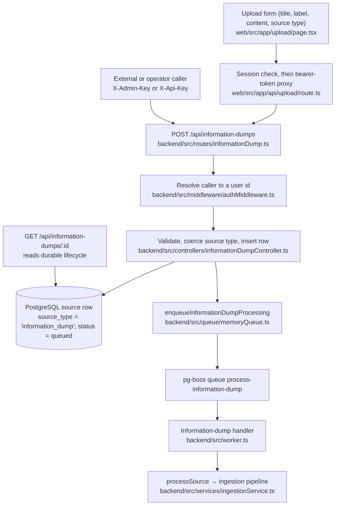

# Information dumps

## Orientation

An information dump is Saturn's non-conversation intake: arbitrary text — a memo, an article, meeting notes, a transcript captured elsewhere — posted to `POST /api/information-dumps` so material the user never said to Saturn still reaches the knowledge graph. The route writes a row into the same PostgreSQL `source` table conversations use and hands it to the same worker pipeline, so this slice owns only the intake seam: who may write on whose behalf, what survives the write, which queue carries it, and what a caller can learn afterwards.

## The path

## Ownership map

| Stage | Owning directory | Entry-point files |
|---|---|---|
| Browser form | `web/src/app/upload/` | `web/src/app/upload/page.tsx` |
| Server-side bearer-token proxy | `web/src/app/api/upload/` | `web/src/app/api/upload/route.ts` |
| Status polling page | `web/src/app/upload/status/` | `web/src/app/upload/status/[id]/page.tsx` |
| Route mounting and protection | `backend/src/routes/` | `backend/src/routes/informationDump.ts`, `backend/src/index.ts` |
| Caller-to-user resolution | `backend/src/middleware/` | `backend/src/middleware/authMiddleware.ts` |
| Validation, persistence, enqueue, status projection | `backend/src/controllers/` | `backend/src/controllers/informationDumpController.ts` |
| Queue declaration and enqueue functions | `backend/src/queue/` | `backend/src/queue/memoryQueue.ts` |
| Job consumption | `backend/src/` | `backend/src/worker.ts` |
| Request and response shapes | `backend/src/types/` | `backend/src/types/dto.ts` |
| Table definition | `backend/supabase/migrations/` | `backend/supabase/migrations/20240101000000_init.sql`, `20260903000000_source_processing_status.sql` |
| Operator upload procedure | — | [[saturn/memo]] |

## Invariants and why

### Who the dump belongs to

- One route accepts three authorities. `X-Admin-Key` compared against `ADMIN_API_KEY` sets `req.user.id` to the literal string `admin` and then *requires* a UUID `user_id` in the body; `X-Api-Key` and a Supabase Bearer JWT resolve a real user and the body `user_id` is ignored. The admin branch exists because programmatic senders outside Saturn have no user session to present.
- The web proxy reads the signed-in Supabase cookie session, forwards its bearer access token, and omits `user_id`. The backend bearer branch derives the owner, so an ordinary signed-in account can write only to its own graph.
- The web upload path no longer reads an admin-key environment variable; cross-user intake is restricted to a caller that directly presents the backend `ADMIN_API_KEY`.
- `GET /:id` and the list endpoint filter on `user_id = req.user.id`, which for an admin-key caller is the string `admin`, not a UUID. The authority that can create a dump for anyone can therefore never read one back.

### What survives the write

- There is no `information_dump` table. `backend/supabase/migrations/` defines the unified `source` table only; the row is distinguished by `source_type = 'information_dump'`.
- The caller's chosen source type is validated against seven UI values (`voice-memo`, `meeting`, `journal`, `book-summary`, `article`, `conversation`, `other`) and then discarded — the inserted `source_type` is always the literal `'information_dump'`. The classification exists to reject junk at the door, not to be remembered.
- That erasure has a downstream effect the intake code does not show: the ingestion orchestrator prefixes voice-memo and journal content with a personal-scope header before extraction, keyed on the payload source type. Because every dump persists as `information_dump`, dump content never receives that wrapping whatever the uploader selected.
- `title` and `label` are collected by the form and forwarded by the proxy; the controller does not read them and the table has no column for either.
- `content_raw` is a jsonb column holding a different shape per intake: conversations write an array of turns, dumps write one plain string. The pipeline normalizes a string by splitting on newlines, so a dump's "turns" are its lines.
- The accepted content length disagrees across three layers: the form enforces 50,000 characters, the DTO comment in `backend/src/types/dto.ts` documents 1–50,000, and the controller accepts 1–500,000.

### Which queue runs it

- Information dumps call `enqueueInformationDumpProcessing`, so they ride `process-information-dump`; its dedicated worker handler calls the shared `processSource` pipeline. Admin queue operations inspect both ingestion queues.
- The Source row is written queued before enqueueing. An enqueue failure sets it failed with the error and attempt count 0, then returns HTTP 500 instead of claiming a completed handoff.
- Retrying a failed information-dump job immediately returns its PostgreSQL Source, and an existing graph Source, to queued and clears its old error before the worker fetches it.

### What a caller can learn afterwards

- The Source row persists `processing_status`, `error_message`, and `attempt_count`. Creation returns queued; `GET /:id` and list results expose those fields with `entities_extracted` and `neo4j_synced_at`, so terminal failure remains distinct after pg-boss deletes its operational record.
- `entities_extracted=true` means every required ingestion phase and both completion transitions succeeded; optional summary failure does not prevent the required graph work — see [[saturn/arch/ingestion-pipeline]].

### Where the web surfaces target a contract the backend does not serve

| Web surface expects | Backend at HEAD |
|---|---|
| `data.job_id` on create (`web/src/app/upload/page.tsx`) | Response is `source_id`, so the success link points at `/upload/status/undefined` |
| `NEXT_PUBLIC_API_BASE_URL` (status page) | Declared in no env file; the proxy uses `NEXT_PUBLIC_API_URL`, so the status page throws before fetching |
| Unauthenticated `GET /api/information-dumps/:id` | Route is behind `authenticateToken` and answers 401 |
| `title`, `label` | Neither is stored or returned |
| `processing_status`, `error_message` | Both are persisted and returned from the unified `source` table |
| `information_dump` table in `web/src/types/database.types.ts` | Migration has the unified `source` table; the web types are regenerated by `dev db supabase types` |
| `information_dump_id` + `job_id` helpers in `web/src/lib/api.ts` | Unused by both pages and matching no route this repository exposes |

### The external boundary

External capture services post to this route as ordinary programmatic callers holding a Saturn key; the Tartarus Omi webhook server is the one in use and lives in a separate checkout. Nothing in this repository references it at HEAD — `backend/src/index.ts` mounts no webhook route and there is no Omi client — so Saturn owns only the authority seam described above, and Tartarus's payload shape, retry behaviour, and Omi-to-Saturn identity mapping belong to its own corpus.

## Edges

- [[saturn/arch/ingestion-pipeline]] — what happens next
- [[saturn/arch/auth-and-identity]] — caller authorities
- [[saturn/patterns/worker-and-queues]] — queue policies and retries
- [[saturn/patterns/api-contracts]] — envelopes and drift
- [[saturn/patterns/postgres-schema-and-types]] — the source table
