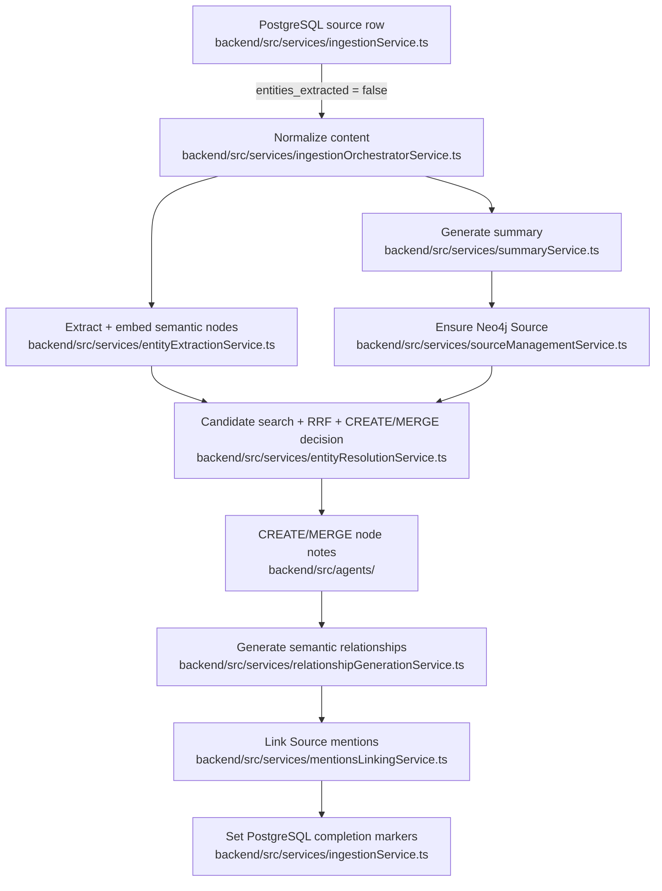

<auto-loaded-context>
<memory-listing dir="saturn/arch">
[[saturn/arch/artifacts]]: When work touches Artifact nodes, the /api/artifacts endpoints, or turning a conversation into a durable output, this knowledge should be read because the feature spans two unconnected stores with an unreachable write path, which decides whether the task is a small fix or a product decision the founder still owes.
[[saturn/arch/auth-and-identity]]: When work touches login, session handling, user-scoped routes, profile creation, or external ingestion, this knowledge should be read because Saturn's three credential classes confer different authority and a successful PostgreSQL identity write can leave Neo4j without an owner.
[[saturn/arch/conversation-lifecycle]]: When work touches conversation creation, transcript exchange, ending, onboarding, or the memory-processing handoff, this knowledge should be read because one PostgreSQL row spans synchronous model work and an asynchronous queue boundary with partial outcomes that still appear complete.
[[saturn/arch/information-dumps]]: When work touches manual or programmatic text upload — the information-dump route, the web upload or status pages, or an external service posting into Saturn — this knowledge should be read because the surface the caller sees, the row that is written, and the queue that runs it disagree at every step, so a change made against any one of them silently misses the others.
[[saturn/arch/retrieval]]: When work touches memory search — changing Explore or Traverse, adding a caller that reads the graph, or explaining why a query returned nothing or the wrong nodes — this knowledge should be read because the executed ranking, tenancy scoping, and write side effects differ from both the retrieval design documents and the tool descriptions callers are told to trust.
</memory-listing>
</auto-loaded-context>

# Ingestion pipeline

## Orientation

Ingestion turns a completed PostgreSQL `source` row into a user-scoped Neo4j Source plus semantic nodes and relationships so later retrieval can answer from what the user said rather than replaying transcripts. The PostgreSQL row is the durable intake and completion record; the graph is a derived interpretation, but the two stores have no shared transaction or reconciliation pass.

## Boundary and state space

The lifecycle has two independent durable axes; neither is a complete pipeline status.

| Axis | Values | Durability | Writer | Meaning |
|---|---|---|---|---|
| PostgreSQL `source.entities_extracted` | `false`, `true` | durable | `backend/src/services/ingestionService.ts` | Admission latch: `true` skips every later job, including a retry after partial graph work. |
| PostgreSQL `source.neo4j_synced_at` | `null`, timestamp | durable | `backend/src/services/ingestionService.ts` | Completion timestamp written with `entities_extracted`; it does not prove that every best-effort phase succeeded. |
| Neo4j Source `processing_status` | absent, `in_progress` | durable | `backend/src/services/sourceManagementService.ts` | Graph-side Source creation marker; the ingestion path never advances it to a terminal value. |
| Pipeline phase results and error list | per invocation | ephemeral | `backend/src/services/ingestionOrchestratorService.ts` | Timing and swallowed-error detail exists only in the running worker and logs. |

## The path

## Transitions

| Event | Source predicate | Target predicate | Guard | Writer | Durable write | Post-commit effect |
|---|---|---|---|---|---|---|
| Worker receives job | `entities_extracted=false` | pipeline running | PostgreSQL row exists and `content_raw` is present | `backend/src/services/ingestionService.ts` | none | Normalize and invoke model/database work. |
| Worker receives completed source | `entities_extracted=true` | unchanged | flag read from PostgreSQL | `backend/src/services/ingestionService.ts` | none | Return success without inspecting Neo4j. |
| Summary and Source creation succeed | Neo4j Source absent or present | Source exists with `in_progress` | summary is required | `backend/src/services/sourceManagementService.ts` | Source node on first run | Semantic resolution gains a provenance key. |
| Optional phase fails | pipeline running | pipeline continues with empty or partial result | failure occurs in extraction, resolution, CREATE/MERGE, relationship generation, or mention linking | owning service or agent | any earlier graph writes remain | Error is logged or returned in the ephemeral error list. |
| Orchestrator returns | `entities_extracted=false` | `entities_extracted=true`, `neo4j_synced_at` set | normalization, summary, and Source creation returned successfully | `backend/src/services/ingestionService.ts` | PostgreSQL completion markers and normalized content | pg-boss sees success even when optional phases failed. |
| Required phase throws | pipeline running | PostgreSQL flags unchanged | normalization, summary, or Source creation fails | `backend/src/services/ingestionService.ts` | any earlier graph writes remain | Worker rethrows and pg-boss may retry. |
| Completion update fails | graph pipeline returned | PostgreSQL flags may remain unchanged | PostgreSQL update error | `backend/src/services/ingestionService.ts` | none | Worker still reports success; a later job can replay graph work. |

## Ownership map

| Stage | Owning directory | Entry-point files |
|---|---|---|
| Job persistence and retry | `backend/src/queue/` | `backend/src/queue/memoryQueue.ts` |
| Job consumption | `backend/src/` | `backend/src/worker.ts` |
| PostgreSQL admission and completion | `backend/src/services/` | `backend/src/services/ingestionService.ts` |
| Phase ordering and normalization | `backend/src/services/` | `backend/src/services/ingestionOrchestratorService.ts` |
| Summary | `backend/src/services/` | `backend/src/services/summaryService.ts` |
| Extraction and initial embeddings | `backend/src/services/` | `backend/src/services/entityExtractionService.ts` |
| Source creation | `backend/src/services/`, `backend/src/repositories/` | `backend/src/services/sourceManagementService.ts`, `backend/src/repositories/SourceRepository.ts` |
| Candidate search and CREATE/MERGE decision | `backend/src/services/` | `backend/src/services/entityResolutionService.ts` |
| Node creation and update | `backend/src/agents/`, `backend/src/repositories/` | `backend/src/agents/createAgent.ts`, `backend/src/agents/mergeAgent.ts` |
| Relationship generation | `backend/src/services/`, `backend/src/agents/` | `backend/src/services/relationshipGenerationService.ts`, `backend/src/agents/createAgent.ts`, `backend/src/agents/mergeAgent.ts` |
| Mention completion pass | `backend/src/services/`, `backend/src/repositories/` | `backend/src/services/mentionsLinkingService.ts`, `backend/src/repositories/SourceRepository.ts` |
| Graph constraints and indexes | `backend/src/db/` | `backend/src/db/schema.ts` |

## Invariants and why

### Source identity and scope

- The worker trusts `source.user_id`, not the queued `userId`, for graph scope; the queued value is trace context only, because the PostgreSQL row is the authority for ownership.
- The worker always supplies `teamId=null` and the owner as the sole participant, because the PostgreSQL source schema does not carry the richer team and participant model accepted by the ingestion payload.
- Neo4j Source lookup uses the PostgreSQL UUID as `source_id`, while graph provenance uses the Source `entity_key`; `ensureSourceNode` bridges them before any semantic node agent runs.
- Existing `content_processed` bypasses normalization; otherwise arrays are trimmed and filtered while strings are split on newlines, so replay can consume a previously normalized representation rather than raw content.

### Extraction and resolution

- Summary and extraction start in parallel, but summary failure aborts before Source creation while extraction failure becomes an empty entity set; this makes a transcript-only Source a completed outcome today.
- Extraction produces Person, Concept, Entity, and Event values and generates a name-plus-description embedding before resolution; Event candidate search nevertheless falls through to the Entity repository.
- Candidate discovery combines embedding, exact-name, and fuzzy-name rankings with RRF, then asks a model for the CREATE/MERGE decision only when candidates exist.
- A candidate-search error is converted to an empty candidate list, and an LLM or validation error is converted to CREATE; CREATE therefore means either “no match” or “resolution could not decide.”
- CREATE operations finish before MERGE operations, and relationship generation waits until both sets finish, because every agent receives the full set of successfully resolved source siblings.
- Individual CREATE, MERGE, and relationship failures are collected or logged rather than thrown from entity resolution; only successful nodes enter the later relationship and mention passes.

### Graph mutation

- CREATE writes intrinsic notes first, then regenerates the node embedding; MERGE appends intrinsic notes, bumps salience, and regenerates the embedding before relational notes are generated.
- CREATE agents receive the full source, but both MERGE phases read only the first 2,000 characters plus an ellipsis; facts later in a source cannot change an existing node or its relationships.
- Person keys are UUIDs, while Concept, Entity, and Event use normalized-name-derived `entity_key` values; an Event `entity_key` uniqueness constraint rejects a repeated CREATE for the same key.
- Person, Concept, Entity, and Source mention relationship creators `MERGE` each single-cardinality edge and retain its original properties on a retry while updating `updated_at`; duplicate parallel edges require an explicit model decision rather than an alternate creation path.
- Repository creation already adds a Source `mentions` edge for a new semantic node; the final mention pass deduplicates references and skips existing Person, Concept, and Entity mentions, but does not include Event targets.
- Notes are serialized properties on nodes and relationships, not separate Note nodes; note provenance points back to the Source `entity_key` and carries retention metadata.

### Completion and replay

- Normalization, summary, and Source creation are the only phase failures that prevent PostgreSQL completion markers; extraction, resolution, relationship, and mention failures still allow `entities_extracted=true`.
- A PostgreSQL completion-update failure is logged and swallowed after graph mutation, so the current invocation succeeds while a later delivery can re-enter from `entities_extracted=false`.
- pg-boss retries only thrown worker failures; its configured retries do not repair swallowed phase errors or a swallowed completion-update error.
- Source creation is re-entry-safe by `source_id` lookup; Event identity is constraint-enforced, and Person/Concept/Entity/Source mention edge creators are re-entry-safe through `MERGE`. Final bulk mention linking still covers Person, Concept, and Entity but not Event.
- There is no transaction across PostgreSQL, model calls, and Neo4j, so “complete” is a control-flow outcome rather than proof that every intended graph write committed.
- Storyline/Macro promotion, retrieval, decay, consolidation, and note cleanup are outside this path; the worker schedules some maintenance separately, but ingestion does not promote Source material into a hierarchy.

## Edges

- [[saturn/arch/retrieval]] — graph consumption
- [[saturn/arch/information-dumps]] — alternate intake
- [[saturn/patterns/worker-and-queues]] — retries and concurrency
- [[saturn/patterns/neo4j-repositories]] — graph write rules
- [[saturn/patterns/memory-hierarchy-and-lifecycle]] — post-ingestion lifecycle
- [[saturn/patterns/provenance-and-personal-scope]] — evidence and tenancy
- [[saturn/patterns/agent-execution]] — model execution
