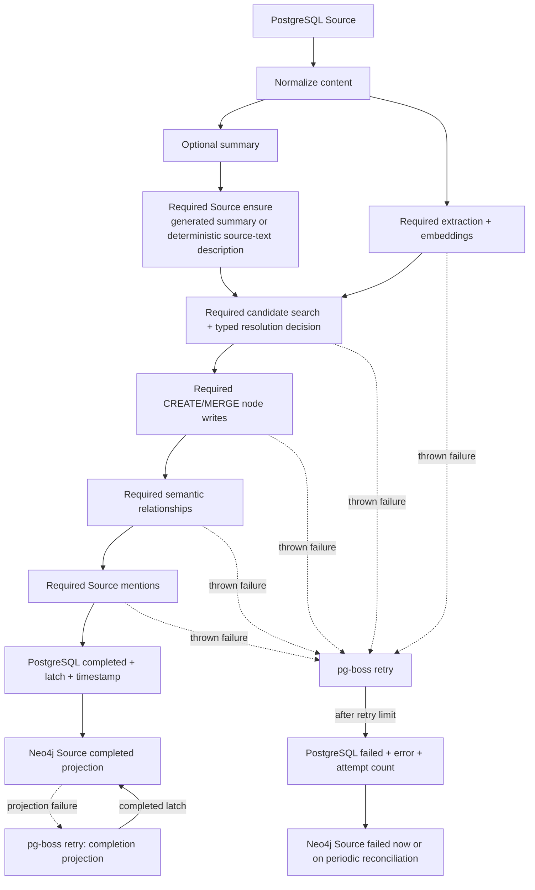

# Ingestion pipeline

## Orientation

Ingestion turns a completed PostgreSQL `source` row into a user-scoped Neo4j Source plus semantic nodes and relationships so later retrieval can answer from what the user said rather than replaying transcripts. PostgreSQL is the durable intake and lifecycle record; Neo4j is the derived interpretation. The stores have no shared transaction, so every thrown required-phase failure leaves earlier writes in place and pg-boss retries the whole path.

## Boundary and state space

| Axis | Values | Authority | Meaning |
|---|---|---|---|
| PostgreSQL `source.processing_status` | `null`, `queued`, `processing`, `completed`, `failed` | producers and `backend/src/services/ingestionService.ts` | Durable ingestion lifecycle. Active conversations remain null until ending; intake sets queued before sending; each worker attempt sets processing; the successful semantic path sets completed; exhausted retries set failed only before that completion latch is durable. |
| PostgreSQL `source.attempt_count` | non-negative integer | worker attempt metadata | Number of executions started, including the initial delivery. Three pg-boss retries produce attempt count 4. An enqueue failure has attempt count 0. |
| PostgreSQL `source.error_message` | null or text | producer enqueue catch and worker terminal catch | Durable cause for failed state; cleared by queued, processing, and completed transitions. |
| PostgreSQL `source.entities_extracted` | false, true | `backend/src/services/ingestionService.ts` | Admission latch. True only after extraction, resolution, relationship generation, mention linking, and the authoritative PostgreSQL completion write succeed. If the subsequent Neo4j completion projection fails, retries reapply only that projection. |
| PostgreSQL `source.neo4j_synced_at` | null, timestamp | `backend/src/services/ingestionService.ts` | Completion timestamp written atomically with the PostgreSQL completed transition and admission latch. |
| Neo4j Source `processing_status` | `queued`, `processing`, `completed`, `failed` | `backend/src/services/sourceManagementService.ts` | Graph-side projection of the durable Source lifecycle. The worker reconciles non-null PostgreSQL statuses into existing graph Sources every 60 seconds after a graph outage. |

## The path

## Transitions

| Event | Source predicate | Target predicate | Guard | Durable effect |
|---|---|---|---|---|
| Producer prepares delivery | ingestion status null or failed | queued | Source row exists | Clear error; queue send follows as a separate commit. |
| Worker receives job | `entities_extracted=false` | processing | Source row and `content_raw` exist | Set attempt count from pg-boss metadata and clear prior error. |
| Worker receives completed Source | `entities_extracted=true` | unchanged completed | latch read from PostgreSQL | Reapply the idempotent Neo4j completion projection without replaying semantic ingestion. |
| Optional summary fails | processing | processing | summary model throws | Record an invocation-local optional error and use deterministic source text as the Source description; required work continues. |
| Required phase fails | processing | processing until another attempt or terminal failure | normalization, extraction, Source ensure, candidate search, decision, CREATE/MERGE, relationships, mentions, or completion write throws | Earlier graph writes remain; worker throws and pg-boss retries. |
| Required semantic path completes | processing | completed | all required semantic stages and the PostgreSQL completion write succeed | Set `entities_extracted=true`, `neo4j_synced_at`, normalized content, clear error; then project completed to Neo4j. |
| Retries exhaust before durable completion | processing | failed | current pg-boss `retry_count` equals `retry_limit` and `entities_extracted=false` | Worker persists the final error and total attempt count, then rethrows so pg-boss records failed. A projection-only failure preserves the already completed Source. |
| Graph unavailable during a lifecycle write | PostgreSQL remains authoritative | Existing graph Source converges to PostgreSQL status | Neo4j update throws | Before the completion projection, the required callback fails and pg-boss retries. After PostgreSQL is completed, redelivery reprojects completed without replaying semantic ingestion. |
| Admin retries failed job | pg-boss failed | An unlatched PostgreSQL and existing graph Source become queued; a latched Source remains completed | admin key and failed job ID | pg-boss moves the job to retry. The normal retry clears the error before the next execution; a completion-projection retry preserves durable completion and reprojects only Neo4j. |

## Required and optional phases

Summary generation is optional because its output is descriptive metadata and deterministic source text can still name the provenance Source without inventing semantic facts. Normalization, extraction, Source creation, candidate search, model decision when candidates exist, node mutation, relationship generation, mention linking, and the PostgreSQL completion write are required because failure in any of them means the graph invariants claimed by `entities_extracted` do not hold. Neo4j completion is the projection of that durable state, so its failure retries only the projection.

A legitimate empty extraction result is successful and can complete with no semantic nodes. An extraction call that throws is not converted into that result. Candidate resolution has three typed outcomes: no candidates, a successful decision with candidates, or failure. No candidates can deterministically CREATE; a search, model, or validation failure throws before node execution and can never be reclassified as CREATE.

## Completion and replay invariants

- The Source row, not queued `userId`, owns content and user scope.
- `entities_extracted=true`, `neo4j_synced_at`, and `processing_status=completed` are written atomically after every required semantic phase succeeds and before the Neo4j completion projection. A projection failure rethrows; redelivery sees the latch and reprojects completed without re-extracting.
- Individual CREATE, MERGE, and relationship failures are aggregated only to retain every cause; the resolution phase still throws and the job still fails.
- Completion-projection failure throws. pg-boss retries only the idempotent graph completion projection because the durable completion latch already prevents semantic re-ingestion.
- Source creation uses `source_id` lookup for re-entry. Sibling uniqueness constraints and relationship `MERGE` behavior make partial-write retries safe at the graph persistence boundary.
- Terminal failure remains visible on PostgreSQL after the pg-boss record is eventually deleted. The terminal-failure update applies only while `entities_extracted=false`, so an exhausted completion-projection retry cannot overwrite durable completion. The status API reads this durable record instead of inferring pending from `entities_extracted=false`.
- PostgreSQL, model calls, pg-boss, and Neo4j still do not share a transaction. Re-entry safety and explicit lifecycle transitions, not rollback, are the recovery model.

## Ownership map

| Stage | Entry points |
|---|---|
| Queue persistence, policy, failed-job projection, retry | `backend/src/queue/memoryQueue.ts` |
| Attempt metadata, terminal failure, and periodic lifecycle reconciliation | `backend/src/worker.ts` |
| PostgreSQL lifecycle and completion | `backend/src/services/ingestionService.ts` |
| DAG and optional/required split | `backend/src/services/ingestionOrchestratorService.ts` |
| Graph Source lifecycle | `backend/src/services/sourceManagementService.ts`, `backend/src/repositories/SourceRepository.ts` |
| Candidate search and resolution | `backend/src/services/entityResolutionService.ts` |
| Relationship generation | `backend/src/services/relationshipGenerationService.ts` |
| Mention completion pass | `backend/src/services/mentionsLinkingService.ts` |

## Edges

- [[saturn/arch/retrieval]] — graph consumption
- [[saturn/arch/information-dumps]] — alternate intake
- [[saturn/patterns/worker-and-queues]] — retries and concurrency
- [[saturn/patterns/postgres-schema-and-types]] — durable Source lifecycle
- [[saturn/patterns/neo4j-repositories]] — graph re-entry guarantees
