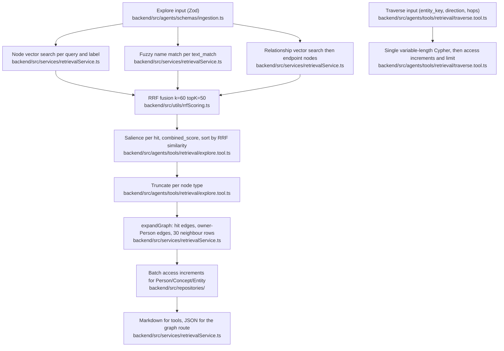

# Retrieval

## Orientation

Retrieval answers a question from the user's Neo4j knowledge graph instead of replaying transcripts: a caller supplies natural-language queries and name fragments, and the path returns a compact markdown (or JSON) picture of matching semantic nodes plus the edges and one-hop neighbours around them. Everything is computed per request — the query embedding, the ranking, and the expansion — with no cache, no preload, and no PostgreSQL vector search; the `source` table carries no embedding column, so Postgres holds content and status while every retrieval signal reads Neo4j.

## The path

## Surfaces

Explore and Traverse are exported executables (`executeExplore`, `executeTraverse`) with AI-SDK tool factories layered on top; each surface below binds its own user id, and that binding is the whole tenancy boundary for the surface.

| Caller | Entry point | User id comes from | Status |
|---|---|---|---|
| Conversation agent | `backend/src/agents/orchestrator.ts` | — | Registers only onboarding and artifact tools; its system prompt still advertises `explore` and `traverse`, so the primary conversation path performs no retrieval. |
| Memory chat (`POST /api/chat/stream-memory`) | `backend/src/controllers/chatController.ts`, `backend/src/routes/chat.ts` | request body | Binds both tool factories; slated for removal by the agent-layer rework, and the retrieval surface becomes the Saturn crtr plugin. |
| MCP server `saturn-graph` at `/mcp` | `backend/src/mcp.ts`, mounted in `backend/src/index.ts` | one process-wide `SATURN_USER_ID`; SSE returns 503 when it is unset | SSE GET plus JSON-RPC POST over a process-local session map, no authentication middleware, exposing exactly `explore` and `traverse`; slated for removal by the agent-layer rework alongside the chat controller. |
| `POST /api/graph/explore` and `POST /api/graph/users/:userId/explore` | `backend/src/routes/graph.ts`, `backend/src/controllers/graphController.ts`, `backend/src/services/graphService.ts` | the URL or the request body, not the authenticated token | Token-authenticated, requests JSON format, and supplies the `0.5` threshold default the tool schema does not define. |

## Ownership map

| Stage | Owning directory | Entry-point files |
|---|---|---|
| Input contracts and defaults | `backend/src/agents/schemas/` | `backend/src/agents/schemas/ingestion.ts` |
| Signal orchestration, ranking, truncation | `backend/src/agents/tools/retrieval/` | `backend/src/agents/tools/retrieval/explore.tool.ts` |
| Graph walk from one node | `backend/src/agents/tools/retrieval/` | `backend/src/agents/tools/retrieval/traverse.tool.ts` |
| Query embedding, Cypher search, expansion, formatting | `backend/src/services/` | `backend/src/services/retrievalService.ts` |
| Rank fusion and score normalisation | `backend/src/utils/` | `backend/src/utils/rrfScoring.ts` |
| Access-counter writes | `backend/src/repositories/` | `PersonRepository.ts`, `ConceptRepository.ts`, `EntityRepository.ts` (`batchIncrementAccess`) |
| Node and neighbour markdown rendering | `backend/src/utils/`, `backend/src/services/` | `backend/src/utils/contextFormatting.ts`, `backend/src/services/retrievalService.ts` |
| Declared vector indexes and uniqueness constraints | `backend/src/db/` | `backend/src/db/schema.ts` |

## Invariants and why

### Ranking

- Explore throws unless at least one of `queries` or `text_matches` is supplied; each semantic query carries its own mandatory threshold, because the schema sets no default and only the HTTP graph service substitutes one.
- Relationship search runs only when semantic queries exist and is on by default; it embeds the query, matches edges carrying `relationship_embedding`, and then converts endpoints into a third signal.
- Every relationship-discovered node enters ranking with a fixed score of `0.7`; the edge's cosine similarity is discarded, so within that signal only insertion order distinguishes hits.
- Each signal deduplicates by `entity_key` and keeps the maximum score before being ranked, so a node matched by several queries contributes one rank, not several.
- RRF fuses the signals by rank with `k=60`, `topK=50`, and no boosts, then maps every unboosted result linearly from raw RRF `[0.01, 0.05]` into `[0.3, 0.6]`. The `similarity` a caller sees is a rank-derived readability number, not a cosine value, and its ceiling is 0.6 on this path.
- Salience is computed for each fused hit and written into `combined_score`, but the final sort deliberately uses RRF similarity alone so that results stay stable when a caller lowers a threshold. Salience therefore changes no ordering and no truncation today; the weighted `0.3 semantic + 0.3 recency + 0.4 salience` score described by the retrieval design document is not implemented.
- Salience itself is connection count multiplied by `max(0.1, exp(-days_since_updated / 30))`, computed by matching `entity_key` with no `user_id` predicate — it relies on the global uniqueness of `entity_key` for identity.
- Per-type truncation to `max_results_per_type` (default 10) happens after the global sort, so one strong node type cannot crowd the others out of the response.

### Scope

- The three entry signals scope by `user_id`: node searches match `{user_id: $userId}` on the label, and relationship search requires both endpoints to carry the user id.
- Every later query relies on `entity_key` uniqueness instead of repeating the user predicate — salience, the endpoint fetch after relationship search, and expansion's edges-between and hit-node queries all match by key only. Only the neighbour query and the owner-Person query re-assert `user_id`.
- Traverse pins its start node with both `entity_key` and `user_id`, but admits connected endpoints whose `user_id` is null, so unowned nodes remain reachable one hop out.
- Traverse builds the only interpolated Cypher in the read path: the direction pattern comes from a three-value enum and the hop count from a 1–3 bounded number, with `entity_key` and `user_id` passed as parameters. Its executable accepts a plain object — validation lives in the AI-SDK tool and the MCP registration, not inside the function — and its implementation and schema both default to `outbound`, while the MCP tool description tells clients the default is both directions.

### Expansion and output

- Expansion returns three edge sets: edges among the hits, edges between hits and the owner Person (`is_owner: true`), and neighbour edges. The neighbour query applies `LIMIT 30` before `DISTINCT`, so thirty is a row budget rather than thirty distinct neighbours.
- Hit nodes have their Neo4j label lowercased into `node_type`; neighbour nodes keep the raw PascalCase label, so a consumer filtering on lowercase types silently discards every neighbour.
- Explore returns at most ten edges, ordered by edge `relevance` and then by recency.
- Embedding and lifecycle properties are stripped on the way out, but not uniformly: relationship search removes `relationship_embedding` explicitly, while the expansion cleanups remove only `relation_embedding` and `notes_embedding`, so an expanded edge can carry a 1536-float vector into the response.
- Reads mutate the graph. Expansion and Traverse batch-increment access counters for Person, Concept, and Entity only — Source, Event, and Artifact never accrue access, so their salience and promotion counters stay flat no matter how often they are returned. Traverse increments before applying its result limit, so nodes the caller never sees still count as accessed.
- Node type reachability is set by the filters Explore applies before each signal: vector search defaults to Concept, Entity, and Source and drops `artifact`; fuzzy matching drops `source` and `artifact`. Person is excluded from the vector default on purpose (people are searched by name), so Person arrives through name matching or relationship endpoints, and Artifact can only arrive as a relationship endpoint.

### Embeddings and indexes

- Query embeddings are generated per request with OpenAI `text-embedding-3-small` (1536 dimensions), the same model ingestion uses for node embeddings; there is no embedding or result cache anywhere on the path.
- `backend/src/db/schema.ts` declares vector indexes for six labels (Person, Concept, Entity, Source, Storyline, Macro) and six relationship types, and swallows creation errors as warnings. No read path calls `db.index.vector.queryNodes`: retrieval computes cosine with `reduce` over a `MATCH`, and the repository search methods use `gds.similarity.cosine`. Every semantic search is therefore a scan over the label's embedding-bearing nodes, and Event and Artifact carry embeddings with no declared index at all.
- Node vector search and relationship vector search each cap at 20 rows per label or per query before fusion, which is the real recall ceiling of the path.

### Not implemented on this path

| Capability described elsewhere | State at HEAD |
|---|---|
| Storyline and Macro retrieval, `granularity` parameter | Labels, constraints, and vector indexes exist; no retrieval input or query reaches them. |
| Weighted final score over semantic, recency, and salience | Computed as `combined_score` and then ignored by the sort. |
| PostgreSQL/pgvector semantic search over sources | No embedding column and no query path; the Supabase repository reads summaries and processing flags only. |
| Retrieval from the primary conversation agent | The prompt describes the tools; the orchestrator does not register them. |
| Context preload or caching between turns | Absent; every call re-embeds and re-queries. |

## Edges

- [[saturn/arch/ingestion-pipeline]] — what retrieval reads
- [[saturn/patterns/neo4j-repositories]] — graph access rules
- [[saturn/patterns/memory-hierarchy-and-lifecycle]] — access and decay policy
- [[saturn/patterns/provenance-and-personal-scope]] — tenancy and evidence
- [[saturn/patterns/agent-execution]] — tool binding and tracing
- [[saturn/arch/artifacts]] — artifact reachability
