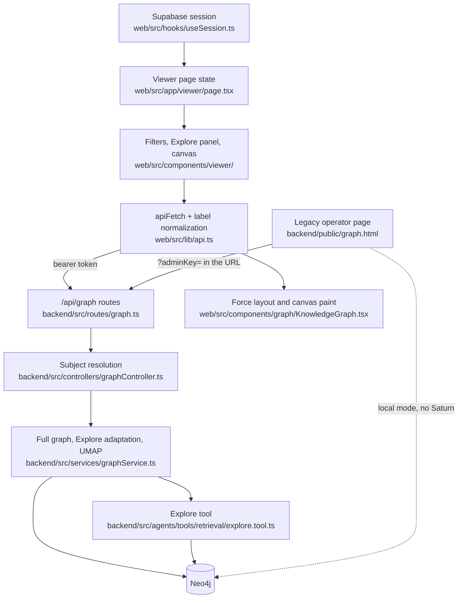

# Web graph visualizer

## Orientation

The graph visualizer is the only surface that shows the knowledge graph itself rather than an answer derived from it: a signed-in person opens `/viewer` to see what Saturn has recorded about them, and an operator opens the separately served legacy page to inspect a graph while debugging ingestion. Two clients read one set of backend routes with different authorities — the React viewer sends a Supabase session token and is confined to its own graph, while the legacy page carries an admin key in its URL and can address anyone. The backend owns retrieval, scoping, property filtering, and the UMAP projection; the browser owns layout, filtering, and presentation.

## The path

## Ownership map

| Stage | Owning directory | Entry-point files |
|---|---|---|
| Session acquisition and the signed-out redirect | `web/src/hooks/` | `useSession.ts` |
| Viewer state: filter values, Explore result, error | `web/src/app/viewer/` | `page.tsx` |
| Filter panel, Explore panel, canvas shell and legend | `web/src/components/viewer/` | `GraphFilters.tsx`, `ExplorePanel.tsx`, `GraphCanvas.tsx` |
| Force layout, canvas paint, detail panel, link tooltip | `web/src/components/graph/` | `KnowledgeGraph.tsx`, `NodeDetailPanel.tsx`, `LinkTooltip.tsx`, `formatters.tsx` |
| The closed node-type union and its colors | `web/src/components/graph/`, `web/src/lib/` | `types.ts`, `graphUtils.ts` |
| Transport, bearer auth, label normalization, `properties` → `details` | `web/src/lib/` | `api.ts` |
| Route mounting and authority | `backend/src/routes/`, `backend/src/middleware/` | `graph.ts`, `authMiddleware.ts` |
| Per-request subject resolution | `backend/src/controllers/` | `graphController.ts` |
| Full-graph reads, Explore adaptation, UMAP projection | `backend/src/services/` | `graphService.ts` |
| Embedding fetch behind UMAP | `backend/src/repositories/` | `GraphRepository.ts` |
| Wire types for the graph seam | `backend/src/types/` | `visualization.ts` |
| Legacy operator page and its static mount | `backend/public/`, `backend/src/` | `graph.html`, `index.ts` |
| Landing-page demo graph | `web/src/components/home/` | `GraphSection.tsx` |

## Invariants and why

### Whose graph a caller can see

- Every route in `backend/src/routes/graph.ts` sits behind `authenticateToken`, and `graphController`'s `resolveUserId` compares every supplied id — path parameter and body `user_id` together — against `req.user.id`, answering 403 on any mismatch. A bearer or API-key caller can therefore only ever address itself, whatever id it puts in the URL; only an admin-key caller may name another user, and two conflicting supplied ids are a 400.
- The React viewer never names a user at all: it reads `userId` from the Supabase session and passes the same value the backend would have derived. `GET /api/graph/users` still exists and returns every owner Person to an admin caller and only the caller's own owner Person otherwise, but no web surface calls it — there is no user selector.
- `POST /api/graph/query` is the one route with `requireAdmin` on top of authentication. It runs the caller's Cypher inside a Neo4j read transaction, binds `user_id` as a parameter without inspecting the query text, and reports any failure as the fixed string `Query rejected` so Neo4j's message never reaches a caller. The web has no Cypher surface and the Next proxy does not forward one; the endpoint exists for an operator driving it by hand.
- `web/src/middleware.ts` matches only `/dashboard/:path*`, `/login`, and `/signup`, so `/viewer` is served to anyone and `useSession` redirects to `/login` client-side. The page shell is public; the data behind it is not.

### What crosses the wire

- The same node carries a different `type` on each read path: full-graph emits the raw Neo4j label (`Person`), Explore lowercases it (`person`). `toNodeType` in `web/src/lib/api.ts` is the single place both are folded into the closed lowercase union in `web/src/components/graph/types.ts`, and it throws on a label outside that union rather than passing it through — an unmapped label fails the whole response instead of rendering as an uncolored node, which is why `getNodeColor` needs no fallback.
- All three read paths in `graphService` copy node and relationship property bags through a primitive-only filter, so arrays and objects — notes, embeddings, structured `content` — never reach the browser. `formatters.tsx` still handles array and object values because it also serves data shapes the graph seam cannot deliver.
- Full-graph derives each node's display name from `name`, else the first 30 characters of `description`, and throws when a node has neither. One nameless node fails the entire full-graph request rather than being skipped.
- Explore accepts a `node_types` filter over six labels (person, concept, entity, event, source, artifact) while the web filter union carries eight, adding storyline and macro. The full graph can return those two; Explore cannot ask for them.
- The full-graph link query requires both endpoints to carry the caller's `user_id`, so a relationship reaching a node owned by someone else is simply absent rather than dangling.
- `properties` → `details` is renamed only in `web/src/lib/api.ts`; every component below it reads `details`.

### What the browser owns

- Layout is never persisted and never provided by the server. `KnowledgeGraph` reconfigures the d3 forces on every mount — charge -50, link distance 25, collision radius 16, and x/y centering at strength 0.7 — so the same graph lands differently each time and a node's position carries no meaning. UMAP is the only embedding-derived layout Saturn computes, and only the legacy page consumes it.
- The viewer applies its name and node-type filters to the full graph only; an Explore result renders exactly as returned and the filter panel is hidden while one is on screen, because Explore has already done its own selection and re-filtering it would silently drop hits.
- Filtered links are copied before they are handed to the canvas: `react-force-graph-2d` rewrites a link's `source` and `target` from ids to node objects in place, so passing the stored links would corrupt the cached full graph.

### The legacy operator page

- `backend/public/graph.html` is a self-contained D3 v7 SVG page served from the API's static mount at `/graph.html`; it is not a build of the React viewer and shares no code with it. It carries force and UMAP views, a PascalCase color map of its own, and a search box that highlights already-rendered nodes.
- It picks its environment automatically — production when hosted on a non-localhost hostname, otherwise a localStorage choice defaulting to local — and takes both `userId` and `adminKey` from URL query parameters, so operator authority travels in a link.
- Local mode bypasses Saturn completely: it posts Cypher to `http://localhost:7474/db/neo4j/tx/commit` with the compose credentials hardcoded in the file, and its query matches every node with no user filter, so it shows every user's graph in the local database. Production mode calls full-graph and umap-projection through the API with `X-Admin-Key`.
- Its search always calls the API route, so without `?adminKey=` in the URL the search fails even in local mode while the graph itself still renders.

### Where else the graph is drawn

- The landing page renders the same `KnowledgeGraph` component on five hardcoded demo nodes with no backend call. Its legend still names People, Projects, Ideas, Topics, You, and Conversations — a taxonomy the graph model no longer has — while the demo nodes underneath it are already person, concept, source, entity, and artifact.
- `web/src/components/search/` holds a search bar and a pipeline visualization with no importer anywhere in the web app; neither is part of this slice's rendering path.
- The upload and status pages are the other half of the loop the viewer completes — see [[saturn/arch/information-dumps]] rather than reading them as viewer surfaces.

## Edges

- [[saturn/arch/information-dumps]] — upload and status pages
- [[saturn/arch/retrieval]] — what Explore ranks
- [[saturn/arch/auth-and-identity]] — the credential classes
- [[saturn/patterns/api-contracts]] — envelopes and drift
- [[saturn/patterns/neo4j-repositories]] — graph reads outside repositories
