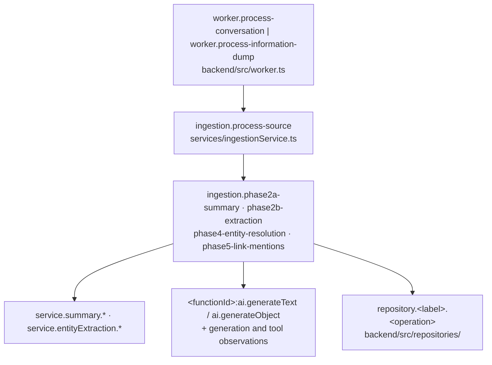

# Observability

## The principle

Saturn has one tracing backend and one way into a process: both the API and the worker start through the shared `bootstrap()` in `backend/src/bootstrap.ts`, which loads env, awaits tracing initialization, then connects Neo4j, initializes schema, and starts pg-boss — and both exit through the shared `shutdown()` in `backend/src/shutdown.ts`: it quiesces pg-boss first so active handlers end their spans, closes Neo4j after handlers no longer use it, then flushes the OpenTelemetry provider last so every span is exported. Tracing is OpenTelemetry spans exported by a Langfuse span processor; there is no second backend, no console exporter, and no application-level structured logger — everything else is `morgan('dev')` on the API and `console` lines captured to `.grove/run/` by `dev start`.

## Why this shape won

- **Env before tracing, and awaited.** `TRACING_MODE` and the Langfuse keys are read inside `initTracing()`, so a process that calls it before `dotenv.config()` silently reads an empty environment, and a process that does not await it turns a credential failure into an unobserved rejection. `bootstrap()` fixes the order once for every entry point and calls `dotenv.config({ override: true })`: the shell environment cannot override any key present in `backend/.env`, so change `.env` to alter a setting for one process; a bad key now fails startup by name (`Langfuse credential validation failed: 401`) from a pre-flight `GET /api/public/projects` before any database is touched.
- **The provider is retained so shutdown can flush it.** The Langfuse span processor batches; the worker routes SIGTERM and SIGINT into `shutdown()` and then exits, so without `tracerProvider.shutdown()` the buffer is discarded and a whole ingestion reaches Langfuse as one detached leaf. `shutdownTracing()` exists for exactly that flush; shutdown waits for active queue handlers, then closes the driver, then flushes tracing so the batch includes every span created while the job drains. Both entry points route signals and uncaught errors or unhandled rejections through this shared path: signals exit 0, while fatal errors upgrade the pending exit to nonzero.
- **`LANGFUSE_BASEURL` is required, not defaulted.** An implicit localhost destination would let a misconfigured deployment look traced while exporting nowhere; all three Langfuse variables throw by name when `TRACING_MODE=langfuse`.
- **One backend, no compatibility wrapper.** The LangSmith `traceable` wrapper around ingestion and the no-op `withAgentTracing` helper were deleted with their packages (`langsmith`, `langfuse`, `langfuse-vercel`, `@vercel/otel`), because one ingestion split across two backends plus console counters is unreadable in all three.
- **No standalone ingestion-orchestrator span.** `runIngestionPipeline` has one caller, `processSource`, whose only callers are the two worker handlers, so every ingestion is already rooted at a `worker.process-*` span with `ingestion.process-source` beneath it; another service-layer root would add a layer carrying no information. A future non-worker caller must open its own root rather than reinstating a wrapper.
- **Bootstrap preserves the fail-closed split.** The API passes `allowNeo4jUnavailable: true`, so an unreachable Neo4j boots the API degraded (`/api/neo4j/health` answers 503) while a schema failure on a live connection closes the driver and exits before the queue starts. The worker passes no option, so any Neo4j failure exits it.

## The map

| Site | File or dir | What it owns |
|---|---|---|
| Startup sequence | `backend/src/bootstrap.ts` | env → `await initTracing()` → Neo4j connect → schema → queue; returns the queue handle and whether Neo4j connected. |
| Exit sequence | `backend/src/shutdown.ts` | Quiesce `stopQueue()` so active handlers finish and their spans end, close the driver, then flush `shutdownTracing()` last. |
| Backend selection | `backend/src/config/tracing.ts` | `TRACING_MODE` of `langfuse` or `disabled` (default `disabled`; any other value throws), credential pre-flight, the retained `NodeTracerProvider` with `LangfuseSpanProcessor`, and `shutdownTracing()`. |
| Span helpers | `backend/src/utils/tracing.ts` | `withSpan`/`withSpanSync` (active span, status, recorded exception, guaranteed end), `sanitizeMetadata`, the `TraceAttributes` key set, attribute builders, `setSessionId`. |
| Prompt-cache observations | `backend/src/utils/cacheLogging.ts` | `logCachePerformance` opens one short `cache.<label>` child span per model call and sets its `saturn.cache.*` token counts, cache read/write, and hit rate directly, so concurrent calls retain separate observations. It is called from summary, extraction, resolution, and the create and merge agents. |
| Optional phase spans | `backend/src/utils/phaseExecutor.ts` | A phase gets a span only when the caller passes `spanName`; ingestion passes one for phases 2a, 2b, 4, and 5. |
| Job roots | `backend/src/worker.ts` | `worker.process-conversation` and `worker.process-information-dump` wrap each job with conversation/source, user, and job id. |
| API spans | `backend/src/services/conversationService.ts`, `backend/src/controllers/chatController.ts`, `backend/src/agents/orchestrator.ts` | `conversation.create`, `conversation.end`, `enqueue-memory-extraction`, `chat.stream`, `orchestrator-agent`. |
| Graph spans | `backend/src/repositories/`, `backend/src/agents/tools/` | `repository.<label>.<operation>` and `tool.<tool name>`. Coverage is uneven: the Person and Event repositories instrument nearly every method, while the Concept and Graph repositories carry one span each. |
| Model-call telemetry | `backend/src/agents/`, `backend/src/services/` | AI SDK `experimental_telemetry` with a `functionId` and metadata — `chat-stream`, `ingestion-generate-summary`, `ingestion-extract-entities`, `ingestion-resolution-decision`, `ingestion-merge-update-relationships`, `query-generator-explore`, `query-generator-cypher`, `summary-generate`. Langfuse renders these as `<functionId>:ai.generateText` / `ai.generateObject` spans with a nested generation and per-tool observations. |
| Trace inspection | `backend/scripts/langfuse-cli.ts` | `pnpm exec tsx scripts/langfuse-cli.ts <command>` — `list-traces`, `get-trace`, `list-observations`, `get-observation`, `list-sessions`, `get-session`, `list-scores`, `get-score`, printing raw JSON through `@langfuse/client` (the client package is CLI-only; the runtime exports through `@langfuse/otel`). |

One ingestion is one trace tree, verified end to end against Langfuse: one trace id, one root, 33 observations.

The API is a separate process with its own provider and its own roots (`chat.stream`, `conversation.create`, `conversation.end`), and the web app has no tracing dependency at all.

## What is not traced today

| Gap | Current behaviour |
|---|---|
| Cross-process continuation | Queue payloads carry only ids (`conversationId` or `informationDumpId`, plus `userId`) and no `traceparent`, so the API's `enqueue-memory-extraction` span and the worker's job root are two unrelated traces. An intake and its ingestion cannot be read as one tree. |
| Nightly maintenance | The decay, consolidation, and note-cleanup handlers emit console lines and no span, so a nightly failure is visible in the worker log and in pg-boss, never in Langfuse. |
| Embeddings | `embedMany` in `backend/src/services/embeddingGenerationService.ts` has neither a span nor `experimental_telemetry`; its latency is absorbed into the extraction phase span. |
| Session grouping | `IngestionPayload.sessionId` has no in-tree writer, so ingestion traces carry an empty session; `setSessionId` fires only in the chat controller, where the value is the conversation id. |
| Trace-level user | Langfuse populates the user field only from AI SDK telemetry metadata, so generation spans carry the user id while `worker.*`, `ingestion.*`, and `repository.*` spans show none, even though `withSpan` sets a `userId` attribute. Extraction sends `userId || 'unknown'`. |
| Token attributes through `withSpan` | `sanitizeMetadata` drops any key containing `token`, `key`, `message`, `content`, `email`, `phone`, `secret`, `password`, or `embedding` — which silently removes the `promptTokens`, `completionTokens`, `totalTokens`, and `messageCount` keys that `TraceAttributes`, `buildLLMAttributes`, and `buildConversationAttributes` define. Token counts reach Langfuse only through AI SDK usage and the `saturn.cache.*` attributes, which are set on the span directly and bypass sanitization. |
| Content in logs | Sanitization covers `withSpan` attributes only. `experimental_telemetry.metadata` is exported as given, and console output prints tool-result and response previews in the chat controller and tool input and reasoning in the create and merge agents. |
| Service name | The provider is constructed without a resource, so exported spans carry the OpenTelemetry default service name rather than the `saturn-backend` the startup line prints; `saturn-backend` is the tracer name in `getTracer`. |
| Declared but unwired | `@opentelemetry/exporter-trace-otlp-http` is still a backend dependency with no import. |

Local `backend/.env` sets `TRACING_MODE=langfuse` against a Langfuse instance; `.env.production` carries no Langfuse keys, so the Railway deployment runs tracing-disabled while production is intentionally down.

The AI SDK call sites are the current generation seam: the chat controller's `chat-stream` and the conversation orchestrator are slated for removal by the agent-layer rework, which moves generation to direct Anthropic and OpenAI calls, while the ingestion, resolution, and query-generator call sites stay.

## Compliance

- Start any new long-lived process through `bootstrap()` and `shutdown()`. A script that loads dotenv and calls `initTracing()` itself re-creates the ordering bug, and one that skips `shutdownTracing()` loses its buffered spans at exit.
- Name spans `<layer>.<subject>.<operation>` to match the existing set (`repository.`, `service.`, `ingestion.`, `worker.`, `tool.`, `chat.`, `conversation.`).
- Instrument through `withSpan`/`withSpanSync` rather than starting a span by hand; they set status, record the exception, and end the span on the throw path that pg-boss retries.
- Give every new model call `experimental_telemetry` with a stable `functionId` and metadata of ids and counts — that metadata is what Langfuse shows as the generation's identity, and it is exported unsanitized, so never put transcript text in it.
- Verify a new attribute name survives `sanitizeMetadata` before relying on it; the filter is substring-based and drops silently.
- Any caller of `runIngestionPipeline` outside the worker handlers must open its own root span; do not add a wrapper inside the service layer.
- Do not add a second tracing backend, a console exporter, or a metrics sink beside this one. Adding a tracing package means deleting the one it replaces, including its call sites.
- Read traces with the Langfuse CLI rather than adding application code that queries Langfuse; `@langfuse/client` belongs to `backend/scripts/` only.

## Edges

- [[saturn/patterns/worker-and-queues]] — job roots, retries
- [[saturn/arch/ingestion-pipeline]] — the traced phase path
- [[saturn/patterns/neo4j-repositories]] — repository span sites
- [[saturn/patterns/agent-execution]] — model-call telemetry
- [[saturn/patterns/api-contracts]] — HTTP surface and logging
